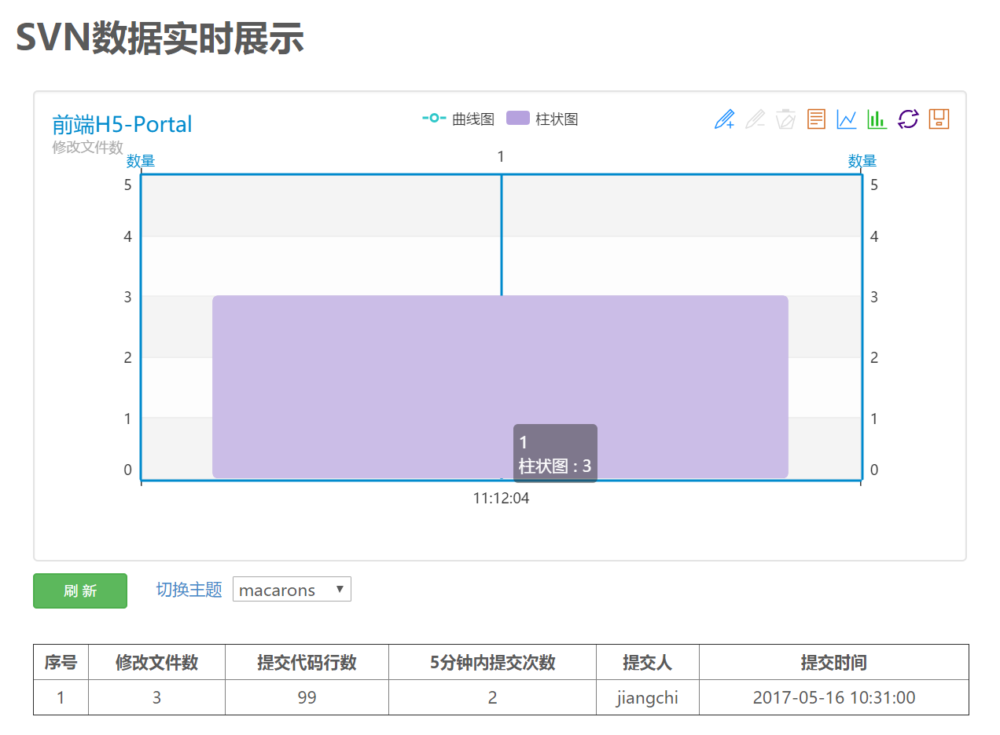
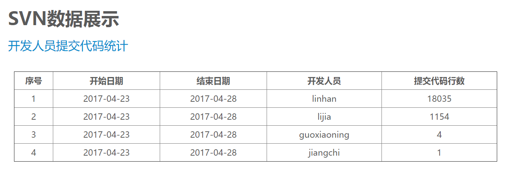
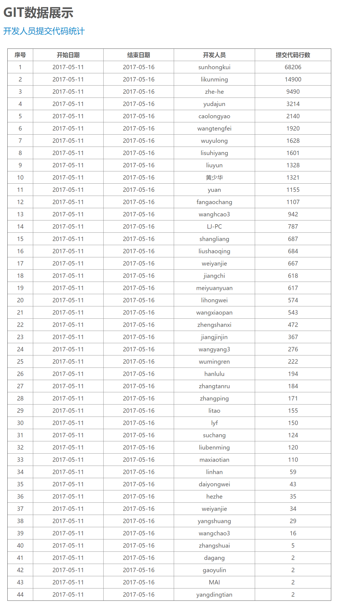
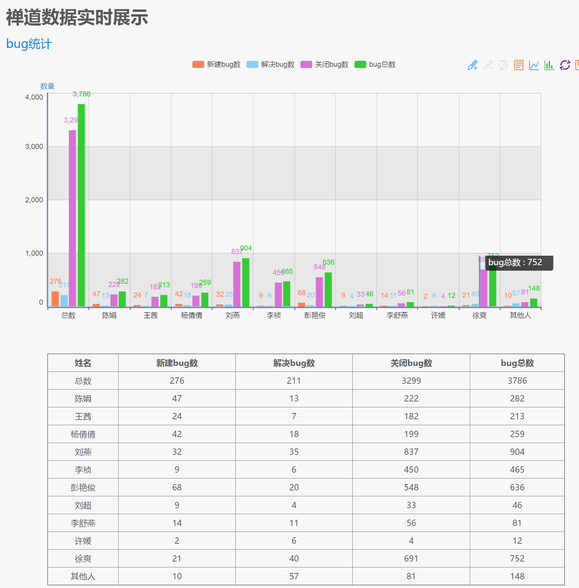

# svn & gitlab 代码统计展示

## svn

```
数据采集脚本目录:
echart/shell/svnscrfile

数据展示页面目录:
www/echart/svnlog
```

## gitlab

```
数据采集脚本目录:
echart/shell/gitscrfile

数据展示页面目录:
www/echart/gitlog
```

# 禅道bug统计

```
数据展示页面目录:
www/echart/zentao
```

# ssh配置文件

```
/root/.ssh/config
```

# git配置文件

```
/root/.gitconfig
```

# mysql配置文件

```
/root/.my.cnf
```

# 效果图展示

## svn代码统计展示图片:



## git代码统计展示图片:


## 禅道bug统计展示图片:


